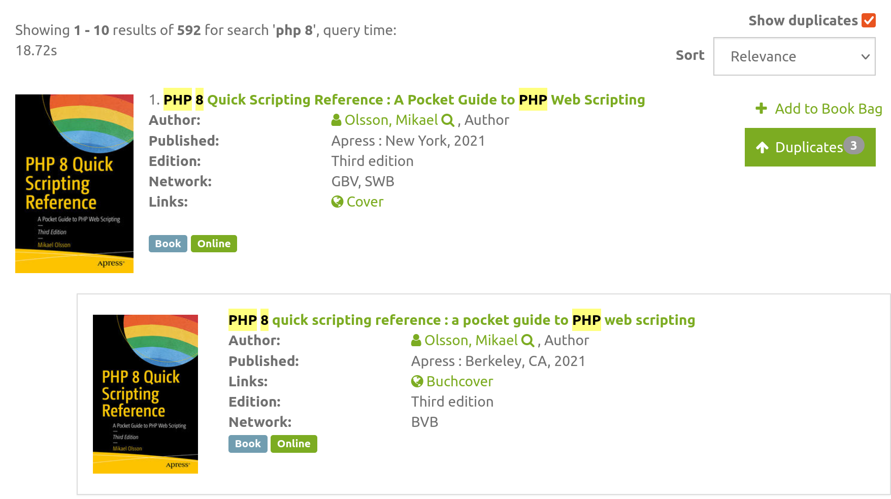

# VuFindResultsGrouping module for VuFind

This module offers a simple and performant but not perfect way to recognize 
duplicate records. It uses [Apache Solr's grouping feature](https://solr.apache.org/guide/8_1/result-grouping.html). 

Solr groups all records with the same matchkey, when called with the grouping 
params below. The first of this similar records in each group is called "master
record" the others are referred as "subrecords". 

Deduplication can optionally be turned on or off by end-users. The last state is 
being saved as cookie. This makes it easy to compare and evaluate deduplication. 

This README describes the steps to get it working and provides some
troubleshooting hints. 

## Quick steps

### Indexing
Index a matchkey field in Solr. A good starting point would be to index 
   `format:isbn:year`
as matchkey, with
- format: this should only be simple formats (about 10 different terms)
- isbn: this should be normalized isbn13
- year: year of publication (yyyy)

In case you don't have an isbn in the metadata, you could use 
    `format:author:title:year:publisher`
or
    `format:author:title:year`
or
    `format:author:title`
as matchkey, with
- format: this should only be simple formats (maybe about 10 different terms)
- author: this should be normalized to lowercase lastname
- title: this should be normalized (lowercase)
- year: year of publication (yyyy)
- publisher: this should be normalized (lowercase, handling of abbreviations and punctuation)

### Enable this module
Enable this module in your `httpd-vufind.conf` & restart Apache.

### Enable this module with composer

Add the following line to your `composer.json`:

    "finc/vufind-results-grouping": "@dev"

Update your composer packages:

    $ composer update

Add the module to your `application.config.php`:

~~~php
$modules = [
    'Laminas\Cache', 'Laminas\Form', 'Laminas\Router', 'LmcRbacMvc', 'Laminas\I18n',
    'Laminas\Mvc\I18n', 'SlmLocale', 'VuFindTheme', 'VuFindSearch', 'VuFind',
    'VuFindAdmin', 'VuFindApi', 'VuFindResultsGrouping'
];
~~~

#### Enabling the VuFindResultsGrouping module along custom code modules

The VuFindResultsGrouping module extends several VuFind classes. Therefore, if
you have added a module with custom code to your VuFind installation which
customizes any of the following classes you need to list the VuFindResultsGrouping module
in the `application.config.php` prior to your custom module and alter the
inheritance references to the VuFindResultsGrouping module accordingly.

VuFind classes extended in VuFindResultsGrouping module:

    \VuFind\AjaxHandler\AbstractBase
    \VuFind\Controller\SearchController
    \VuFind\Search\Factory\AbstractSolrBackendFactory
    \VuFind\Search\Solr\Params
    \VuFindSearch\Backend\Solr\Backend
    \VuFindSearch\Backend\Solr\Response\Json\RecordCollection

### Use trait
In your record driver, use the `SubrecordTrait` by adding
~~~php
class Your RecordDriver extends SolrMarc {
    ...
    use VuFindResultsGrouping/RecordDriver/SubrecordTrait;
    ...   
}
~~~
This just adds some accessor methods. It will not interfere with your 
custom code. 

### Add params to config
In your local `config.ini` add the following to `[Index]` section`
~~~ini
[Index]
...
group = true
group.field = "enter the name of your matchkey here"
group.limit = 10
~~~

### Template work
Take a look in our example template to see how it's working. We are using 
Bootstraps collapsible classes to show a button that opens all the 
duplicates.

## User interface

### JavaScript
Add `js/dedup.js` to your theme configuration.  

### HTML / Templates

We use Bootstraps collapse function to implement this. It might require 'bootstrapizing'
VuFind's `result-list.phtml` because Bootstrap often conflicts with the Flexboxes used in
default VuFind.

#### Checkbox 
Put the HTML from `search/controls/dedup.phtml` where you want the checkbox 
the enable / disable grouping, for example in`search/results.phtml`.

#### Button
We need a button to open/close the collapsible `div`. It can be found in 
`RecordDriver/DefaultRecord/result-list-dedup-button.phtml` and should be put under the existing
buttons "Add to favorites" and "Add to book bag". 

Notice the two random strings `pid` (panel id) and `pgid` (panel group id), that controls the 
link between a button and a collapse. It must be unique for each record. 

#### Collapsible records

The subrecords itself can be found in `RecordDriver/DefaultRecord/result-list-subrecords.phtml`. 
This code should be put to `result-list.phtml`, too. We placed it at the end of a record. 

#### Limitations
Be aware that we do not provide templates for `result-grid` based layouts. 

## External Sources
* [German presentation by Stefan Winkler](https://www.vufind.de/wp-content/uploads/2018/09/2-1-Grouping-Deduplizierung-mit-Matchkeys-in-BOSS3-VuFind-AWT-2018.pdf) 
